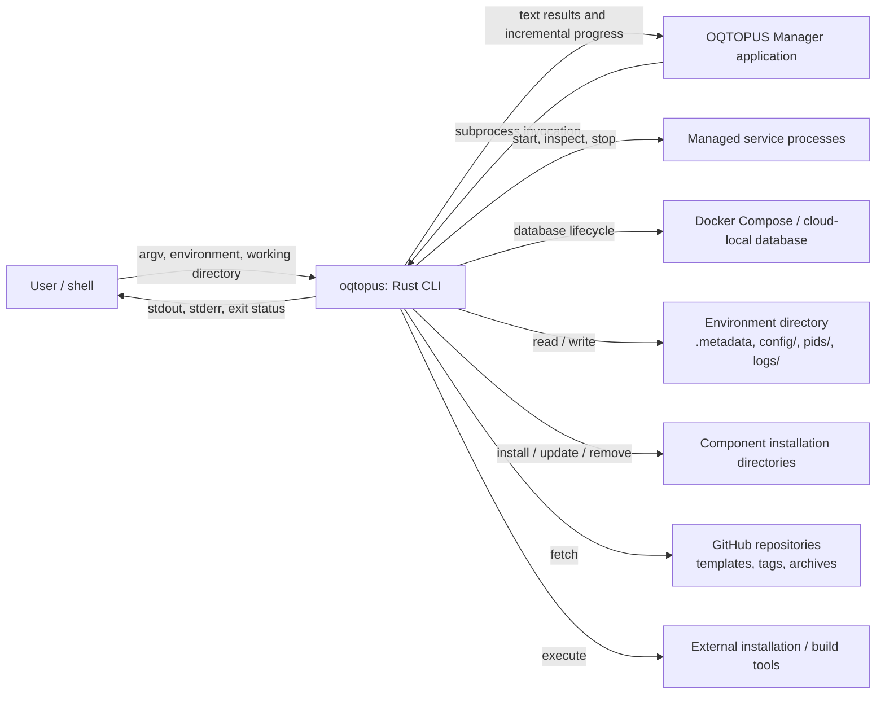
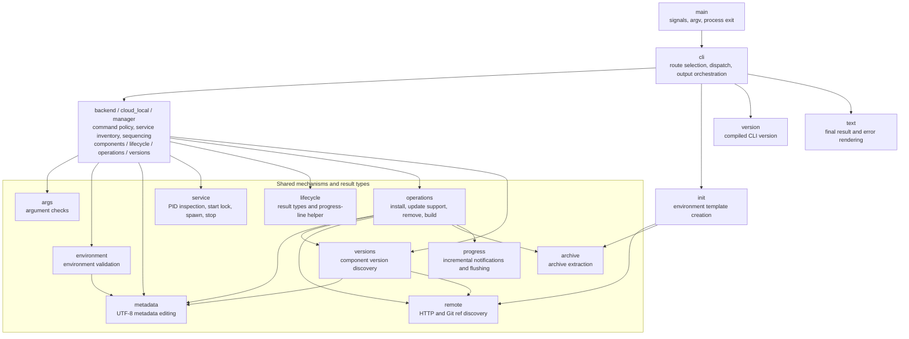

# Rust CLI runtime architecture

## Scope and completion criteria

This design covers the review cleanup for PR #35: module responsibilities,
UTF-8 text handling, and recoverable process startup. It describes the intended
maintained code, with every CLI route implemented natively.

The cleanup is complete when:

- command dispatch lives in `cli`, with only process-wide setup and exit in
  `main`;
- each domain owns its command orchestration and service/component definitions,
  while shared modules implement reusable mechanisms;
- metadata has one UTF-8 representation and one set of editing functions;
- simultaneous starts cannot launch duplicate processes, startup can recover
  after caller termination, and failed startup does not leave an untracked
  running service; and
- focused recovery tests and the existing compatibility suite pass.

Completion generation and release packaging are implemented. Installer work
remains tracked separately in the migration record.

## System context

The diagrams describe the current Rust implementation. Arrows in this
context diagram are labeled interactions. The external OQTOPUS Manager application is a
CLI caller, distinct from the internal `manager` module that manages its service.



The environment layout and CLI output are compatibility boundaries: the Manager
also reads environment files directly. Background process output is redirected
to a service log or discarded according to domain policy. Foreground services
inherit the CLI's standard streams.

## Responsibilities and dependencies

### Module map

Arrows below mean calls or dependencies on shared types, not execution order.
The map shows the main responsibility boundaries rather than every import.
The three domain modules are grouped to avoid repeating their common edges;
each owns its own `components`, `lifecycle`, `operations`, and `versions`
submodules. Grouping does not introduce a shared domain dispatcher.



Command-specific results return to `cli` for rendering through `text`. Progress
can be written during execution through `progress` or explicit flushed writes;
it does not wait for final result rendering. `version` describes the CLI binary,
while `versions` discovers component releases and installed versions.

Entry points: [main](../src/main.rs), [cli](../src/cli.rs),
[backend](../src/backend.rs), [cloud_local](../src/cloud_local.rs),
[manager](../src/manager.rs), and [init](../src/init.rs).

`main` owns process-wide signal setup, argument acquisition, and process exit.
`cli` owns routing, command dispatch, stream selection, final rendering, and
mapping command outcomes to exit codes. Arguments are validated as UTF-8 once
in `main`; invalid arguments receive a rendered error and exit status 1.

`backend`, `cloud_local`, and `manager` own their command argument handling,
environment requirements, component definitions, service command construction,
and sequencing of start/stop/restart or installation steps. These domains may
use submodules to keep related operations readable. A command is found under
its domain rather than in a catch-all module for every lifecycle operation.

Shared modules have concrete responsibilities:

- `args`: the argument checks every command family repeats, such as recognizing
  a usage request and rejecting a target outside a service inventory;
- `service`: process inspection, startup exclusion, PID publication, child
  execution, environment-file loading, and stopping a process;
- `operations`: reusable release/branch installation, synchronization, binding
  updates, removal, and runtime build mechanics;
- `environment` and `metadata`: environment validation and metadata editing;
- `remote` and `archive`: network/ref discovery and archive extraction;
- `text` and `progress`: result rendering and incremental notifications.

Shared command outcome types and small argument helpers may live in a common
module, but that module must not own domain orchestration. Final result data
remains separate from its rendering. Incremental notifications stay explicit,
with the existing stream and flush behavior. Shared process/install mechanisms
may emit progress while working; this is not a reason to introduce a generic
output framework.

Service membership has one authoritative inventory per domain. Status order,
startup order, and shutdown order are separate policies, named explicitly
where they differ. Sharing an inventory must not silently reorder commands or
output consumed by the Manager. Component-specific policy stays with the
domain; reusable execution steps belong in shared helpers.

The CLI's compiled version and remote component release discovery are different
responsibilities. Their similar names alone do not justify combining modules.

## Text and compatibility

Metadata and other text files use `String`/`&str`. Invalid UTF-8 is rejected at
the read boundary rather than interpreted through a lossy view or preserved
through a parallel byte-oriented editing implementation. Network archives and
other binary payloads continue to use byte buffers.

UTF-8 does not imply normalization: successful `info` output retains source
text, including unknown fields, ordering, and CRLF. Updating a metadata key
preserves unrelated text. Metadata replacement remains atomic so readers do
not observe a partially written file. Unsupported non-UTF-8 metadata behavior
is an intentional compatibility change, not a new snapshot baseline to accept
automatically.

The Manager boundary remains unchanged for supported input: arguments, result
text, ordering, exit codes, standard streams, incremental progress, and runtime
paths. Refactoring does not relax these contracts. Internal comments should
explain current requirements and invariants; historical Bash explanations belong
in migration decisions when they are needed to justify compatibility.

## Process startup and termination

### Process-backed service startup

This sequence follows [service::start_process](../src/service.rs), called by a
domain's lifecycle module after environment validation. It covers one
process-backed service; multi-service ordering remains in the domain. The
cloud-local database uses Docker Compose and has a separate startup path.
Arrows represent calls, file operations, and returned outcomes over time.

```mermaid
sequenceDiagram
    participant CLI as cli
    participant Domain as Domain lifecycle
    participant Env as environment
    participant Service as service::start_process
    participant OS as OS / environment files
    participant Child as Child process

    CLI->>Domain: start(args, output)
    Domain->>Env: Validate environment
    Env-->>Domain: Environment or error
    Note over Domain,Service: Continue only after successful validation and argument checks
    Domain->>Service: Start service with command factory
    Service->>OS: Acquire nonblocking flock on persistent start.guard
    alt Lock unavailable or live legacy lock owner
        Service-->>Domain: Startup error; no child spawned
    else Lock acquired and legacy lock checked / recovered
        Service->>OS: Inspect recorded service PID
        alt Service already running
            Service->>OS: Release startup lock
            Service-->>Domain: Report skipped start; success
        else No running service
            Service->>OS: Remove stale PID file, if present
            Service->>Domain: Construct service command
            Domain-->>Service: Program, arguments, environment
            Service->>OS: Load config/.env and configure standard streams
            Service->>Service: Flush pending progress
            Service->>OS: Open service PID file
            Service->>Child: Spawn with inherited guard and PID descriptors
            Child->>OS: Publish own PID before exec
            Child->>Child: exec service command
            Note over OS,Child: Close-on-exec closes child guard descriptor; parent retains lock
            alt Spawn / pre-exec / exec fails
                Service->>OS: Remove PID file and release lock
                Service-->>Domain: Startup error
            else Foreground service
                Service->>OS: Release startup lock
                Service->>Child: Wait for completion
                Child-->>Service: Exit status
                Service->>OS: Remove matching PID file
                Service-->>Domain: Child exit code
            else Background service
                Service->>Child: Check for immediate exit after 200 ms
                alt Child already exited
                    Service->>OS: Remove PID file and release lock
                    Service-->>Domain: Startup error
                else Child still running
                    Service->>OS: Release startup lock after progress output
                    Service-->>Domain: Startup success
                end
            end
        end
    end
    Domain-->>CLI: Lifecycle result or error
```

Preparation failures also return an error and release the acquired lock. The
background check detects immediate process exit; it is not an application
readiness probe. If the CLI is killed after spawning, the child still publishes
its PID before exec. A later start either sees the live PID and skips startup,
or removes a stale PID and retries. The persistent guard file is never deleted.

Startup exclusion uses a nonblocking OS file lock on the persistent
`pids/.<service>.start.guard` file. The file must never be removed during normal
cleanup: removing it could allow two callers to lock different inodes. Because
it outlives every start, an existing guard is opened read-only, which needs no
write access to lock: a guard created by one user must not permanently lock out
another. The OS releases the lock when its last owning descriptor closes,
including after SIGKILL. The old `.<service>.start.lock` directory and owner PID remain for
diagnostics and legacy lock recovery; their cleanup is not the source of mutual
exclusion between Rust callers.

The lock covers stale PID cleanup, command preparation, spawn, PID publication,
and the immediate-exit check. A foreground service releases the startup lock
before waiting for completion. The guard descriptor is close-on-exec so a
running service does not retain the lock.

The child writes its PID before executing the service, using only
async-signal-safe operations between fork and exec. Until exec it inherits the
startup guard. This closes the interval where killing a parent after spawn but
before parent-side PID writing would leave an untracked service. If the caller
dies after publication, a retry observes that service and does not start a
second instance. A PID left by a dead service is removed on retry.

Recovery tests exercise real subprocesses and bounded readiness waits, including
concurrent starts, forced termination, stale legacy locks, and immediate startup
failure. Normal `Drop` cleanup remains useful, but cannot be relied upon for
termination recovery. This guarantees process-level recovery; power-loss
durability and a distributed/network-filesystem lock protocol are outside the
local CLI's scope.

## Deferred work

The review explicitly defers the cross-cutting error-handling redesign. Its
follow-up should retain underlying IO/network/archive errors, add operation and
path context, and centralize user-facing formatting without breaking the
Manager's exit/stream contract. Existing `String`/unit error APIs are retained
in this cleanup except for errors necessary to express UTF-8 rejection and
startup failures.

Adopting `clap`, structured JSON output, and a shared output trait remain
separate changes. If the temporary migration document is deleted after the
port, retain this runtime design and the permanent compatibility decisions in
developer documentation.
